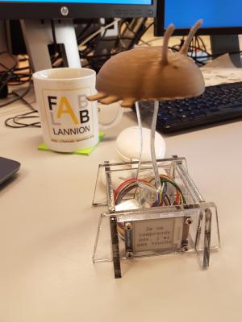

# BugTrophy

A developper trophy for the best bug !



* 3D printed bug for the trophy
* laser cutted pedestal (plexiglass 4mm)
* epaper display to show best quotes from the developper

## hardware

### trophy

### electronics
Based on weemos D1-mini and Waveshare 1.54 epaper display.
* https://wiki.wemos.cc/products:d1:d1_mini
* https://www.waveshare.com/wiki/1.54inch_e-Paper_Module

## software
Dependencies (installable via arduino interface) :
* esp8266 board https://wiki.wemos.cc/tutorials:get_started:get_started_in_arduino
* Adafruit_GFX library https://github.com/adafruit/Adafruit-GFX-Library

Dependencies (downloaded from github) :
* GxEPD library from ZinggJM https://github.com/ZinggJM/GxEPD

### quotes
They are hardcoded in *quotes* array. Do not forget to update the *NB_QUOTES* define.

### logo
During startup, an image is displayed. You need a b&w png image of 200x200px
See otarie.png as exemple.

Convert (with imagemagick) the png image to .h file for inclusion in the code :
```bash
 convert otarie.png  -background white -alpha remove -monochrome -define h:format=gray -compress none -depth 1 otarie.h
```

### font
The included font is created from DejaVu font. https://dejavu-fonts.github.io/

To created the .h file, use fontconvert from Adafruit_GFX
```bash
 ./fontconvert /usr/share/fonts/truetype/dejavu/DejaVuSansMono.ttf 16 32 255 > DejaVuSansMono16pt8b.h
```
